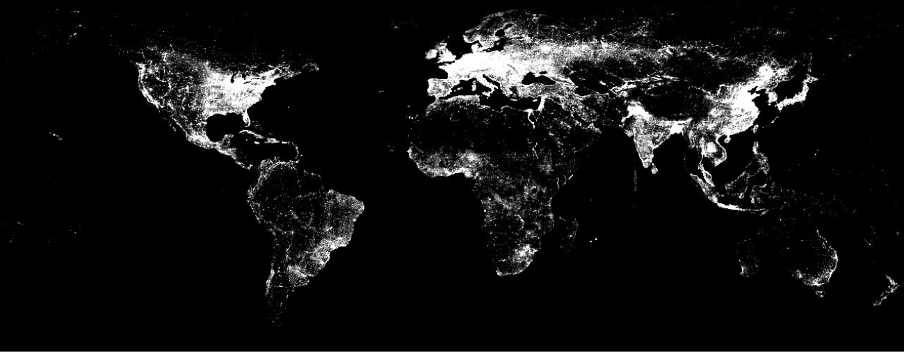

```{r setup, include=FALSE}
### SETTING CHUNK OPTIONS 
knitr::opts_chunk$set(echo = FALSE, message = FALSE, warning = FALSE, fig.width = 6, fig.height = 5, fig.pos="H", fig.pos = 'H')

```

<!-- ############################## -->
<!-- # Start Writing here: -->
<!-- ############################## -->

# Introduction \label{Introduction}

In recent years, the usage of remote sensing data has expanded exponentially due to its potential for new and diverse applications in socioeconomic research. These data sources are often deemed largely objective and free from standard sample selection challenges, and is thereby suitable as a proxy in a broad array of studies that require the usage of potentially unreliable or unavailable data. This advantage is especially pertinent in parts of the developing world, where reliable data can be relatively hard to come by. One of the most prominent remote sensing data avenues has been the satellite-derived nightlight luminosity data sets, with luminosity often being used as a proxy for important measures such as population counts^[See, for instance, @mellander2015night.], economic activity and growth ^[@elvidge1997; @henderson2012 and @chen2011 are prominent examples.] and regional inequality indices.^[Such as in @ivan2020nlinequality and @mveyange2015.] One of the most common nightlight luminosity data sets, the 'Stable Lights' product derived from the Defense Meteorological Satellite Program's (DMSPs) Operational Linescan System (OLS), has seen a vast array of applications. However, there remains questions surrounding its reliability and accuracy. This paper emphasises some of these shortcomings. Most prominently, DMSP-OLS has difficulty in separating background noise from night lights generated from human-generated light, especially in areas that display lower levels of night light intensity. This presents an obvious and difficult-to-overcome challenge: analyses that attempt to use Stable Lights as a proxy for economic activity, for instance, may either exaggerate or understate economic activity in these low-luminous areas, which proves difficult to rectify.

In addition to pointing out these and other shortcomings, this paper also attempts to address the challenge of background noise by applying a filtering technique to identify and separate nightlights emitted by humans from those emitted by other sources. This filtering process is based on the methodology for deriving the 'Local Human Lights' product by @maatta, and relies on a Random Forest (RF) machine learning algorithm for classification. Whilst drawing largely on @maatta, there remains distinct differences in approach between our methodology and theirs. Most prominently, @maatta apply their filter on the entire world, whilst including some inputs that are region-specific. In contrast, we apply their methodology only to the South African subset of data, which carry some implications in terms of application. This, and other deviations, will be explicated on in more detail in section \ref{Methodology}, however. The rest of the paper is laid out as follows: section \ref{problem} briefly discusses some of the primary challenges with the DMSP-OLS data, whilst section \ref{Methodology} discusses the noise-filtering methodology and the data inputs needed for the RF algorithm. Section \ref{Results} presents some results and visualizations, and section \ref{Discussion} concludes.

```{r stable,fig.cap="\\label{stable} The Raw Stable Lights Image", echo = FALSE, message = FALSE, warning = FALSE, out.width="100%", fig.height = 5, fig.pos="H"}

knitr::include_graphics("figures/stable_full.png")

```

# Night Light Data and Noise \label{problem}

The Stable Lights product is one of the most popular remote sensing data sets in circulation. This is due largely to its numerous uses described in the previous section, but also because of its public availability and ease of use. The primary product is derived from the DMSP-OLS nighttime light emissions data, which is captured by satellites that measure global light emissions at night. The raw satellite data is processed by the National Oceanic and Atmospheric Administration (NOAA) in collaboration with the American National Geophysical Data Center (NGDC), and involves the manipulation of the raw data to compensate for cloud coverage, ephemeral events and some other sources of background noise. The compiled Stable Lights product is thus a yearly composite of datum consisting out of a grid of numbers ranging from 0 (no emission) to 63 (the maximum emission readable by satellite sensors), where each cell, or pixel, reflects the light emissions of an area approximately 0.86 square kilometers in size at the equator. The DMSP-OLS series consists of 6 satellites collectively active over the period 1992-2013, with some satellites capturing data across the same years.

Despite its usefulness, and despite attempts to minimize the potential for noise, the stable lights product has some notable limitations. First, its radiometric resolution (6-bit data with values ranging only from 0 to 63) is relatively low and therefore not sensitive to changes in emissions, whilst it also has a fairly large spatial resolution. These two factors limit the accuracy in emissions-measurement. A further and prominent limitation is concerned with the intensity and extent of lit-up areas, where pixel saturation and the blooming effect complicate the direct delimiting of especially urban regions. Saturation here refers to the upper-bound luminosity value of 63, meaning that certain highly-lit areas will show no variation of emissions over time. The blooming effect is a well-known phenomenon wherein the identification of a lit area is consistently larger than its corresponding settlement.^[This occurs due to the coarse spatial resolution of the OLS sensors, large overlap in the footprints of adjacent OLS
pixels, and the accumulation of geolocation errors in the compositing process.] Similarly, the sensors that capture these emissions differ across satellites, and can also suffer from sensory degradation, thereby not necessarily being directly comparable. In order to accurately compare NL emissions across years, one would have to perform intercalibration, something that the DMSP-OLS data sets do not contain
on-board (@elvidge1997relation; @elvidge2013viirs).

The most prominent difficulty, however, relates to the amount of noise in the lower end of the light
distribution, due in part to the blooming effect mentioned above. A common solution to the problem of noise is to either filter out data below a certain threshold, or set those values to an arbitrarily small number between 0 and 1. This is, however, a quick-and-easy solution that effectively throws away potentially important and insightful information. Figure \ref{stable_no_noise} below displays the difference between the raw Stable Lights image, which includes suspected noise at the lower end of the light spectrum, and the image where all cell values below 6 are transformed to 0.1, an arbitrary number often used in these analyses. Even when comparing the images visually, it is evident that large swaths of data on the peripheries of urban centers are discarded. In addition to the arbitrarily-chosen threshold and replacement values, the loss of variability in cell values makes it especially difficult to perform statistical analyses in a large variety of cases.

```{r stable_no_noise,fig.cap="\\label{stable_no_noise} Left - Raw Stable Lights; Right - Noise Discarded", echo=FALSE, fig.width = 5, fig.height = 5, fig.show = "hold", out.width  =  "50%"}

knitr::include_graphics("figures/stable_SA.png")
knitr::include_graphics("figures/stable_SA_noise_filtered.png")

```

The latter challenge constitutes the primary emphasis of the methodology implemented in the subsequent sections. However, the paragraph above should serve as a reminder that there exists other accuracy-related problems with the DMSP-OLS data sets.

# Method and Data \label{Methodology}

We follow the methodology advanced by @maatta, where the authors propose a process of noise filtering with the aim to more accurately identify _human-emitted_ nightlights. Successful implementation would negate the need to drop observations believed to be noise. If one can accurately discern between which lights are human generated and which ones are not, one can remove only those classified as noise and thereby prevent data loss. The process the authors propose utilises a Random Forest (RF) machine learning algorithm to predict where places have a higher likelihood of displaying human-generated light activity, based on satellite data of built-up and settlement areas. @maatta develop two distinct products - Global Human Lights and Local Human Lights - for the F15 satellite in 2001. While the global product minimizes bias arising from the usage of regional information, the local product maximizes predictive accuracy. The local and global products differ largely due to the incorporation of a a battery of local light variables derived from the average visible lights and the percentage frequency of light detection products for the local product. This greatly improves the detection of lights generated by humans, especially on the African continent. As our emphasis is on more accurate prediction, and also only on the South African NL subset, we are most interested in replicated and extending the methodology for the local product. Before delving into more detail regarding the employed algorithm, however, it would be useful to first briefly discuss the primary data inputs.

## Data {-}

Table \ref{variable_table} below gives an overview of the most important variables used as inputs. The Global Human Settlement Layer (GHSL) _built-up_ grid - satellite-derived images of the world based on Landsat satellites - is used to classify whether a certain area is more likely to contain human generated light, as humans are active in areas where there are buildings and infrastructure. The built-up data is thus the measure whereby the algorithm classifies whether lit pixels can be classified as human generated or not.^[For more on the GHSL methodology, consult @pesaresi2016operating.] The second and third variables constitute the two primary DMSP-OLS products released by NOAA, and is also the most crucial inputs in the filtering methodology.^[These two products, together with Stable Lights, constitute all of the publicly available DMSP-OLS data.] This is due to the fact that the subsequent variables are derived from them. The _local noise_ variable is used to identify those areas where background noise is systematically larger than some threshold, and consists out of the number of pixels in a window of 499 by 499 pixels below this threshold.^[We follow @maatta in choosing the upper bound threshold value of 6 so as to be most strict in what is considered noise.] The _local detections_ counts the number of pixels where zero light is detected in a 399 by 399 window around a pixel. The rest of the variables are generated to be regional input variables that more closely describe the characteristics of luminosity surrounding a specific pixel. By varying the size of the area around a pixel, one more accurately accounts for spatial correlations in light that is human generated. 

\begin{table}
\begin{center}
\begin{tabular}{ |l|l|l| }
 \hline
 Input & Source & Description  \\ 
 \hline
  built up & GHSL & Landsat satellite images of built-up areas \\ 
  avg light & DMSP-OLS & average light per pixel over a year \\ 
  freq light & DMSP-OLS & proportion of days where light is detected per pixel \\
  local noise & Derived from DMSP-OLS & number of pixels below threshold in avg light image \\
  local detections & Derived from DMSP-OLS & accounts for regional differences in freq light \\
  lm freq 5 & Derived from DMSP-OLS & average of freq light in a 5 by 5 pixel area \\
  lm avg 25 & Derived from DMSP-OLS & average of avg light in a 25 by 25 pixel area \\
  lm freq 99 & Derived from DMSP-OLS & average of freq light in a 99 by 99 pixel area \\
  lm avg 199 & Derived from DMSP-OLS & average of avg light in a 199 by 199 pixel area \\
  \hline
\end{tabular}
\caption{Data Inputs}
\label{variable_table}
\end{center}
\end{table}

The derived variables in Table \ref{variable_table} are displayed in Figure \ref{local_images} below. These are the local input images for the F18 satellite, which recorded light emissions in 2011. For each iteration of the algorithm across the three satellites, these 6 variables are derived anew. 

```{r local_images,fig.cap="\\label{local_images} Local Image Inputs", echo = FALSE, message = FALSE, warning = FALSE, out.width="100%", fig.height = 5, fig.pos="H"}
 
knitr::include_graphics("figures/local_inputs.png")

```

## Methodology {-}

@maatta's methodology necessitates four primary steps: First, the regional night light variables are created from the original _avg light_ and _freq light_ DMSP-OLS products. Second, the world map is divided in various sub-regions, as the random forest algorithm will be run on each sub-region separately. All the variable images are cropped into 2000-pixel square sub-regions, which equates to about 3.4 million $km^2$. Each sub-region further consists of approximately 4 million rows of datum, whilst the model is trained on a 10% subsample. However, running the algorithm on separate sub-regions introduces variability in the classification rule, which, in turn, translates to discontinuous jumps in predicted probabilities at the borders of each region. To address this, each window is jittered in small steps of 250 pixels, and the algorithm is applied for each of the jittered steps. The results are then averaged to smooth away border effects. In step three, probability thresholds are derived for each region, and subsequently used to create image masks that indicate whether a pixel is above the probability threshold of it being human generated or not. The final step entails overlaying the original _avg light_ image with the masks for each region, and then creating a mosaic from all of the sub-regions to create the final local product.

The random forest algorithm is used to predict the probability of lights being of human origin or not. It does this by using the built up data as a proxy for human activity. One cannot merely use the built up data directly to filter out noise, as human-generated light can also be generated in areas that are not built up, and conversely, some built-up areas do not emit any lights (like country roads, for instance). This means therefore that measures commonly used to assess the prediction accuracy of a random forest - such as the accuracy and F1 scores - cannot be used as is, as these scores would merely relate how accurately lights relate to built-up area. @maatta instead propose introducing a tolerance threshold, where pixels are classified in order of highest probability, until the threshold level of the _avg light_ pixels is reached. This inevitably implies that a choice must be made about the threshold value; if the threshold is higher, less pixels will be classified as lit up, and _vice versa_. In fact, there are numerous choices that trade off necessity with more accurate human light detection. The choice of threshold being one of them, but so also the size of the steps that smooths the border effects; the size of the sub-region windows; which regional light variables to include; at which probability level to classify lights as definitely human-generated (the classification rule); as well as a backstopping rule.^[These choices are in addition to the standard parameter-decisions required for a random forest. In our case, the most prominent parameters are chosen as follows: mtry = 1 (due to computational limitations), splitrule = "gini", min.node.size = 10, num_trees = 200, and trees are always split on the _avg_ and _pct_ variables.] It is therefore important to note where our methodological decisions diverge from the default values proposed by @maatta.

First, our application extends @maatta's machine learning methodology to include the F14 satellite for 2001 and the F18 satellite for 2011, as well as re-estimating the F15 satellite for 2001, specifically for South Africa.^[Refer to the following github repository to view further technical details and code: https://github.com/Coetsee/Noise_Filter_DMSP/tree/main/ADV_CS/Write_up/Adv_CS_Write_Up] Practically, the process involves four steps: 1) cropping the relevant South African satellite images into 200 × 200 pixel sub-regions; 2) applying the RF algorithm for each sub-region separately to predict class probabilities, where applying the algorithm separately allows the model to learn how light characteristics relate to built-up areas across different regions and thus different classification rules, as one would expect the relationship to vary across areas. Like with @maatta, our model is trained on a 10% subsample, and model inputs include the battery of derived local light variables, the two DMSP-OLS products mentioned before and the built-up data set. In step 3) the tolerance of classifying low value pixels as human-generated is set to 4%, meaning that light is classified as human-generated in the order of highest probability until 4% of the average light pixels with values smaller than 5 are included. Moreover, all pixels with a predicted probability of less than 20% are set to 0 to ensure that no pixels are added for areas with no human-generated light. This step therefore derives probability thresholds for each sub-region, which is then used to create separate masks that indicate when a certain pixel is above the probability threshold. These masks are then combined to form a mosaic across all sub-regions. The final step involves the creation of the final product by taking the value from the average visible band image if a pixel is classified as being human generated more than eight times out of the possible 64.^[@maatta find that eight classifications balances the trade-off between potential misclassification and improved detection best.] The output therefore consists of an image of light pixels with a high probability of being human-generated. The 4-step process described above is repeated for each satellite-year combination, thereby producing three images of human-generated lights. 

In terms of differences in approach, the size of the sub-windows has already been mentioned. This choice is due to the fact that many of the tasks needed for successful implementation of the filtering procedure are intensive both in terms of computing power and memory usage. Due to computational limitations, we therefore employed AWS' EC2 cloud computing platform for parallel computation. This proved costly, however, and implementation thereby required some other deviations from the methodology presented in @maatta. Most crucially, the random forest algorithm was only applied to a subset of the world data. As our research interests entailed a specific country, South Africa, we limited the regional sub-windows to a single square window, roughly the size of South Africa, which we then divided into smaller sub-windows. Where @maatta thus subdivided the entire globe according to 64 areas - using these overlapping subdivisions to classify whether the light for each pixel is human-generated - we also create 64 sub-windows, but only for South Africa.^[These sub-windows consist of a matrix of 1979 by 1525 cells.] This potentially results in gains in accuracy due to the increased number of subdivisions for South Africa specifically, as well as greater accuracy in smoothing out border effects due to our usage of smaller step-values for moving these windows (25 pixels rather than 250). In combination, we expect our results to be more accurate than in @maatta. Furthermore, and more practically, where @maatta only looked at one satellite and one year, we applied our methodology over three satellites and two periods. This necessitated the usage of separate built-up satellite images for these years, which, in turn, required interpolation from the existing built-up data which was only available for the years 2000 and 2014. We do not expect interpolation here to be particularly problematic, however, as built-up area is slow to change substantially, and would thus not be a problem from 2000 to 2001, and from 2011 to 2014. In terms of classification and backstopping rules, as well as threshold values, we use the default values as recommended by @maatta.

# Results \label{Results}

Figures \ref{final} and \ref{final_light} display the final local human lights images. Figures \ref{final} includes scale to illustrate cell values, whilst Figure \ref{final_light} displays the same image for illustrative purposes. These are the final outputs of the filtering methodology for the F18 satellite for the year 2011. The final plots for the other two satellites are displayed in the Appendix.

```{r final,fig.cap="\\label{final} Local Human Lights Image with Scale ", echo = FALSE, message = FALSE, warning = FALSE, out.width="100%", fig.height = 5, fig.pos="H"}

knitr::include_graphics("figures/final.png")

```

```{r final_light,fig.cap="\\label{final_light} Local Human Lights Image", echo = FALSE, message = FALSE, warning = FALSE, out.width="100%", fig.height = 5, fig.pos="H"}

knitr::include_graphics("figures/local_human_lights_image.png")

```

For an application such as the one described above, it is difficult to convey and visualize results in an easy-to understand way. This is compounded by the fact that common measures of prediction accuracy in a random forest cannot be used for reasons mentioned earlier. Nonetheless, we believe that our application does at least as well as @maatta's. Those authors found that the local human lights product increases the detection rate of human settlements by 15.3% in Africa over that of the stable lights product.^[Replicating these results fall outside of the scope of our paper, however.] Furthermore, and more importantly, the authors found that the numbers of pixels lit in Africa increases from 2.95% using stable lights to 8.25% using local human lights, an increase of nearly 5 and a half percentage points. This increase is evident in our analysis as well, if one visually compares Figures \ref{final} and \ref{final_light}, which display the final local human lights images, to Figure \ref{stable_no_noise} above.^[As is evident, there remains potential in improving how to adequately display results for an application such as this. For instance, it would be good to be able to overlay the raster images with different colours so as to visualize the difference between the stable lights and local lights images on the same plot.] Overall, this would indicate that data at the lower end of the luminosity spectrum, which would have been discarded or replaced by an arbitrarily small value, can be used with confidence that it is human-generated. Over and above this improvement, however, is that the local human lights product also produces more data in general than the stable lights product - a distinct advantage. 

# Discussion \label{Discussion}

This paper extended the usage of a filtering methodology that separates background noise from human-generated nightlight data to a specific country - South Africa - for the years 2001 and 2011.Our results echo those by @maatta: the RF algorithm introduces great improvements in classification accuracy and thus greater accuracy in filtering out background noise from the  'Stable Lights' product. This allows the researcher to do away with the need for quick-and-easy type fixes to filter out noisy data at the lower end of the luminosity distribution. However, it is important to note what this method does not achieve. For instance, the 'Human Lights' product does not address the issue of oversaturation at the higher end of the luminosity spectrum. Likewise, its spatial resolution remains low in comparison to more modern products such as the Visible Infrared Imaging Radiometer Suite (VIIRS), and it is recommended to use these products rather than the DMSP-OLS 'Stable Lights' or 'Human Lights' products. Of course, this is not possible if one desires to study NL data in the pre-VIIRS era. In those cases, the success in separating noise from human-generated light at the lower end of the spectrum may prove valuable in a variety of use-cases. For instance, if one were to be interested in obtaining a rough measure of economic activity in Sub-Saharan Africa, where data is often lacking and data is often clustered in the lower end of the spectrum, then applying this filtering technique might be extremely beneficial. Similarly, if one were to attempt to create a Gini-type inequality index based on NL data, then this strategy also holds promise. Lastly, it is reassuring that the potential to further leverage remote sensing, big data and machine learning to address the other challenges in these data sets remain as well, and should be actively pursued so as to improve analysis accuracy over and above what has been proposed in this paper. 

[Words: 2952 excluding references, footnotes, bibliography and abstract]

\newpage

# References {-}

<div id="refs"></div>

\newpage

# Appendix {-}

```{r builtup,fig.cap="\\label{builtup} Interpolated 2014 built-up data from GHSL", echo = FALSE, message = FALSE, warning = FALSE, out.width="100%", fig.height = 5, fig.pos="H"}



```

```{r finalf142001,fig.cap="\\label{finalf142001} Final Local Human Lights Image for the F14 satellite for 2001", echo = FALSE, message = FALSE, warning = FALSE, out.width="100%", fig.height = 6, fig.pos="H"}

knitr::include_graphics("figures/finalf14.PNG")

```

```{r finalf152001,fig.cap="\\label{finalf152001} Final Local Human Lights Image for the F15 satellite for 2001", echo = FALSE, message = FALSE, warning = FALSE, out.width="100%", fig.height = 6, fig.pos="H"}

knitr::include_graphics("figures/finalf15.PNG")

```


