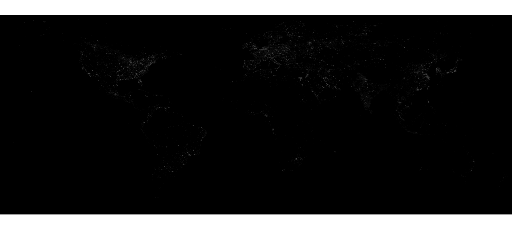
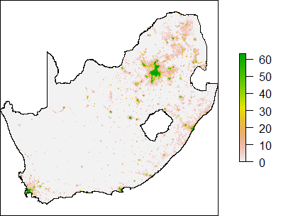
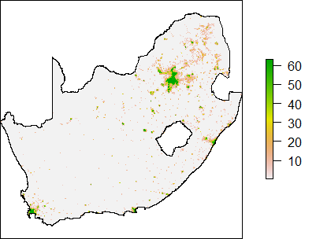
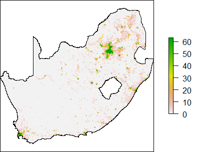
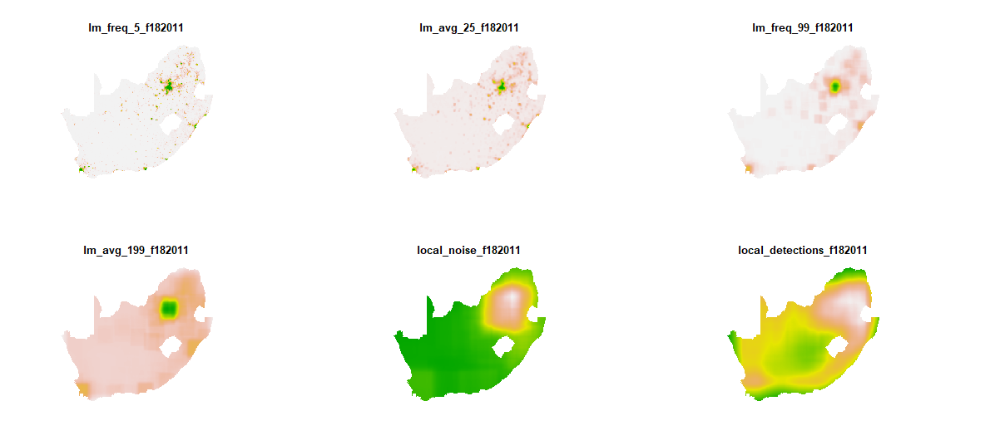

```{r setup, include=FALSE}
### SETTING CHUNK OPTIONS 
knitr::opts_chunk$set(echo = FALSE, message = FALSE, warning = FALSE, fig.width = 6, fig.height = 5, fig.pos="H", fig.pos = 'H')

```


<!-- ############################## -->
<!-- # Start Writing here: -->
<!-- ############################## -->

# Introduction \label{Introduction}

In recent years, the expansion of the usage of remote sensing data presents potential for new and diverse applications in socioeconomic research. These data sources are often deemed largely objective and free from standard sample selection challenges, and is thereby suitable as a proxy in a broad array of studies that require the usage of potentially unreliable or unavailable data. This advantage is especially pertinent in parts of the developing world, where good data can be relatively hard to come by. One of the most prominent remote sensing data avenues has been the satellite-derived nightlight luminosity data sets, with luminosity often being used as a proxy for important measures such as population counts^[See, for instance, @mellander2015night], economic activity and growth ^[@elvidge1997; @henderson2012 and @chen2011 are prominent examples] and regional inequality indices.^[Such as in @ivan2020nlinequality and @mveyange2015]

There exists different night lights products which can be utilized towards this end, the most common of which is the 'Stable Lights' product, derived from the Defense Meteorological Satellite Program's (DMSPs) Operational Linescan System (OLS). This paper emphasises the usage of this product specifically focusing on its shortcomings. Most prominently, DMSP-OLS has difficulty in separating background noise from night lights generated from human-generated light, especially in areas that display lower levels of night light intensity. This presents an obvious and difficult-to-overcome challenge: analyses that attempt to use Stable Lights as a proxy for economic activity, for instance, would exaggerate or understate economic activity in these low-luminous areas. 

This paper attempts to address the challenge of inaccurate measurement of night lights by applying a filtering technique to identify and separate nightlights emitted by humans from those emitted by other sources. This filtering process is based on the methodology for deriving the 'Local Human Lights' product by @maatta, and relies on a Random Forest (RF) Machine Learning algorithm for classification. Whilst drawing on @maatta, there are distinct differences in approach. Most prominently, @maatta apply their filter on the entire world, whilst including some inputs that are region specific. The following paper encapsulates data only from South Africa, thereby foregoing the necessity for region-specific adjustments. This, and other deviations, will be explicated on in more detail in section \ref{Methodology}, however. The rest of the paper is laid out as follows: section \ref{problem} briefly discusses some of the primary challenges with the DMSP-OLS data, whilst section \ref{Methodology} discusses the noise-filtering methodology and the data inputs needed for the RF algorithm. Section \ref{Results} presents some results and visualizations, and section \ref{Discussion} concludes.

plot of initial stable lights product:

```{r stable,fig.cap="\\label{result_plot} The Raw Stable Lights Image", echo = FALSE, message = FALSE, warning = FALSE, out.width="100%", fig.height = 5, fig.pos="H"}



```


# Night Light data and Noise \label{problem}

## Stable Lights and Economic Activity

The Stable Lights Product is a 

The most prominent difficulty, however, relates to the amount of noise in the lower end of the light distribution due in part to the blooming effect mentioned above. Standard practice using the stable lights data set is to discard these values from analysis, thereby removing a large proportion of cell observations. 


Common solution to the problem of noise is to either filter out data below a certain threshold, or set those values to 0.1 (Source NB NB NB)

```{r stable_no_noise,fig.cap="\\label{result_plot} Left - Raw Stable Lights; Right - Noise Discarded", echo=FALSE, fig.width = 5, fig.height = 5, fig.show = "hold", out.width  =  "50%"}




```


```{r final,fig.cap="\\label{result_plot} Human Lights Image ", echo = FALSE, message = FALSE, warning = FALSE, out.width="100%", fig.height = 5, fig.pos="H"}



```


# Method and Data \label{Methodology}


- Short overview of @maatta

The filtering process used by @maatta attempts to more accurately detect _human-generated_ night light luminosity. 


## Data 

Table \ref{variable_table} below gives an overview of the most important variables used as inputs in the machine learning algorithm. The Global Human Settlement Layer (GHSL) _built-up_ grid - satellite-derived images of the world based on Landsat satellites - is used to classify whether a certain area is more likely to contain human generated light.^[For more on the GHSL methodology, consult @pesaresi2016operating]. The second and third variables constitute the two primary DMSP-OLS products released by NOAA, and is also the most crucial inputs in the filtering methodology. This is due to the fact that the subsequent variables are derived from them. The _local noise_ variable is used to identify those areas where background noise is systematically larger than some threshold, and consists out of the number of pixels in a window of 499 by 499 pixels below this threshold.^[We follow @maatta in choosing the upper bound threshold value of 6 so as to be most strict in what is considered noise] The _local detections_ counts the number of pixels where zero light is detected in a 399 by 399 window around a pixel. The rest of the variables are generated to be regional input variables that more closely describe the characteristics of luminosity surrounding a specific pixel. By varying the size of the area around a pixel, one more accurately accounts for spatial correlations in light that is human generated. 

\begin{table}
\begin{center}
\begin{tabular}{ |l|l|l| }
 \hline
 Input & Source & Description  \\ 
 \hline
  built up & GHSL & Landsat satellite images of built-up areas \\ 
  avg light & DMSP-OLS & average light per pixel over a year \\ 
  freq light & DMSP-OLS & proportion of days where light is detected per pixel \\
  local noise & Derived from DMSP-OLS & number of pixels below threshold in avg light image \\
  local detections & Derived from DMSP-OLS & accounts for regional differences in freq light \\
  lm freq 5 & Derived from DMSP-OLS & average of freq light in a 5 by 5 pixel area \\
  lm avg 25 & Derived from DMSP-OLS & average of avg light in a 25 by 25 pixel area \\
  lm freq 99 & Derived from DMSP-OLS & average of freq light in a 99 by 99 pixel area \\
  lm avg 199 & Derived from DMSP-OLS & average of avg light in a 199 by 199 pixel area \\
  \hline
\end{tabular}
\caption{Data Inputs}
\label{variable_table}
\end{center}
\end{table}

## Methodology 

The variables above constitute the primary inputs for @maatta's 'Human Lights' product. Methodologically, the following five steps are necessitated:

First, the regional night light variables are created from the original _avg light_ and _freq light_ DMSP-OLS products. 

Second, the world map is divided in various sub-regions, in preparation that the random forest algorithm be run on each sub-region separately. All the variable images are cropped into 2000-pixel square sub-regions, which equates to about 3.4 million $km^2$. Each sub-region consists of approximately 4 million rows, whilst the model is trained on a 10% subsample.

---------------------
5. Local Human Lights Process
 However, the changes in the classification rule across the sub-regions
causes a problem at their borders. The shifts in predicted probabilities, and consequently the number
of lit pixels, are visibly clear.
The solution for smoothing the border effects is to move the sub-region window in smaller steps
and then average the results. The step size should be as small as possible, but we rapidly run into
computational constraints. Therefore, we decide to move the window in steps of 250 pixels so that we
receive 64 values for each pixel. Unlike in the global approach, we now set the number of lit pixels
within each window by using a 4% tolerance level. This means that we keep classifying light in pixels
as human-generated in the order of highest probability until 4% of avg_light pixels with values below 5
are included. By setting the amount of light with this tolerance threshold, we avoid having to make
subjective choices of light amounts across regions or base them on the built-up data. However, we have
to include a backstop or we end up adding lit pixels also in areas where there is no human-generated
light at all. Therefore, we additionally set all pixels with a predicted probability less than 20% of being
human-generated to zero.
As described above, we classify light in each pixel 64 times by the overlapping sub-region windows
as human-generated or not. After Step 3 in the filtering process, we mosaic all the windows and
count the classifications. We then create the final product in Step 4 by taking the light value from the
average visible band image if a pixel is classified as human-generated more than eight times out of
64. Otherwise, we set the light value in a pixel to zero. The requirement of eight human-generated
light classifications makes a final global adjustment to the amount of light. We have chosen the light
amount settings in a way that balances the improvement in detecting human-generated light while
keeping misclassifications at a low level. Howeve
---------------------


Many of the tasks needed for successful implementation of the filtering procedure are intensive both in terms of computation and memory usage. Due to computational limitations, we therefore employed AWS' EC2 cloud computing platform for parallel computation. This proved costly, however, and implementation thereby required some deviations from the methodology presented in @maatta. Most crucially, the random forest algorithm was only applied to a subset of the world data. As our research interests entailed a specific country, South Africa, we limited the regional sub-windows to a one-square window, roughly the size of South Africa. Although this step may carry some costs in that it means that less regional variability is accounted for, these costs are mitigated by the possibility that there would not be large regional variability within a single country in any case. 

Other Differences: 

- Size of area
- Jitter size 
- Probability of human-generated
- only f152001, we do f142001 and f182011 as well


# Results \label{Results}


- maps comparing stable lights with noise removed vs human-generated light (overlay map)
- also amount/percentage of pixels saved
- accuracy measures? 


# Discussion \label{Discussion}

This paper extended the usage of a filtering methodology proposed by @maatta with which to separate 
background noise from human-generated nightlight data. 

Our results echo those by @maatta: the RF algorithm introduces great improvements in classification 
accuracy and thus greater accuracy in filtering out background noise from the  'Stable Lights' product. 
This allows the researcher to do away with the need for quick-and-easy type fixes to noisy data at the
lower end of the luminosity distribution. 

However, it is important to note what this method does not achieve. For instance, the 'Human Lights' 
product does not address the issue of blooming or oversaturation at the high end of the luminosity 
spectrum. Likewise, its spatial resolution remains low in comparison to more modern products such as the 
Visible Infrared Imaging Radiometer Suite (VIIRS), and it is recommended to use these products rather
than the DMSP-OLS 'Stable Lights' or 'Human Lights' products if possible. 


\newpage

# References {-}

<div id="refs"></div>

\newpage

# Appendix {-}

- images of all the different local images - refer them back to variables table


```{r local_images,fig.cap="\\label{local_images} Local Image Inputs", echo = FALSE, message = FALSE, warning = FALSE, out.width="100%", fig.height = 5, fig.pos="H"}
 


```


```{r filtered,fig.cap="\\label{result_plot} Local Images used as Inputs", echo = FALSE, message = FALSE, warning = FALSE, out.width="100%", fig.height = 5, fig.pos="H"}

```

overlay plot of the above two with different colours
